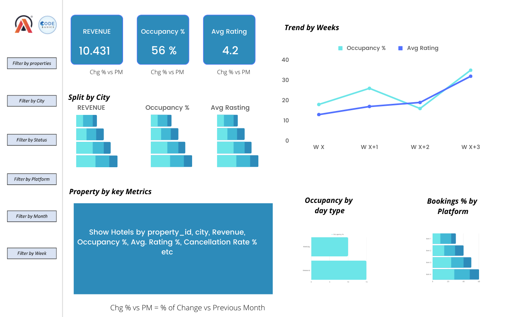

# AtliQ Hospitality Analysis - PowerBI

As part of the codebasics september month resume challenge, I have worked on this analysis project.

Link to the [Challenge](https://codebasics.io/challenge/codebasics-resume-project-challenge)

Link to [Interactive Dashboard](https://app.powerbi.com/view?r=eyJrIjoiNmQ4NTcwNmMtNDc3Yi00MjM4LThkMzItZTQyZWJjNjA0ZDVhIiwidCI6ImM2ZTU0OWIzLTVmNDUtNDAzMi1hYWU5LWQ0MjQ0ZGM1YjJjNCJ9&pageName=ReportSection)

## Problem Statement 

Atliq Grands owns multiple five-star hotels across India. They have been in the hospitality industry for the past 20 years. Due to strategic moves from other competitors and ineffective decision-making in management, Atliq Grands are losing its market share and revenue in the luxury/business hotels category. As a strategic move, the managing director of Atliq Grands wanted to incorporate “Business and Data Intelligence” in order to regain their market share and revenue. However, they do not have an in-house data analytics team to provide them with these insights.

Their revenue management team had decided to hire a 3rd party service provider to provide them insights from their historical data.

## Tasks Breakdown

You are a data analyst who has been provided with sample data and a mock-up dashboard to work on the following task.

1. Create Metrics According to the Metric List:

- Go through the provided metric list to understand what KPIs (Key Performance Indicators) are critical for Atliq Grands.

- Common metrics for the hospitality industry may include:
   - Average Daily Rate (ADR)
   - Revenue Per Available Room (RevPAR)
   - Occupancy Rate
   - Customer Satisfaction Score (from reviews)
   - Market Share % over time

- Ensure that these metrics are correctly calculated from the available historical data.

2.Create Dashboard Based on the Mock-up:

- Follow the mock-up provided by stakeholders closely.

- Ensure you include visuals such as bar charts, line graphs, and tables to represent the KPIs clearly.

- Make the dashboard intuitive and user-friendly, highlighting key insights.

3. Provide Additional Insights Not Mentioned in the Metric List:

- Explore the data for trends or anomalies that are not directly requested. For example:
   - Analyze booking trends by season or region.
   - Identify customer segments that contribute the most revenue.
   - Understand the relationship between occupancy rates and pricing strategies.
   - Find hidden correlations between customer feedback and hotel performance.

- These additional insights can help Atliq Grands make data-driven decisions beyond just the requested metrics.

## Provided Mock-Up Dashboard

## Data Model

## Overall Analysis 

## Monthly Analysis View 

## Learnings and Implementations

**1. Calendar Visual Using Matrix Table:**

- Built a Calendar visual utilizing the matrix table in Power BI. This visual is versatile and can be adapted for various analytical purposes. (Referenced an article for this implementation.) [Article Reference](https://www.linkedin.com/pulse/calendar-matrix-syed-ahmed-ali/?trackingId=VgyLpo%2BYxVRs8tD03PXcPQ%3D%3D)

**2. Hotel Cancellation Policies Analysis:**

- After reviewing different hotel cancellation policies, I learned that most hotels charge no fee for cancellations made three months prior to the booking date. For cancellations made closer to the booking date, fees generally range from 60% to 90% of the booking cost.

**3. Bookmarks and Selections for Page Navigation and Filter Clearing:**

- Mastered the use of bookmarks and selections to create website-like page navigation and to implement a "clear filter" button on the dashboard. (Gained insights through a [YouTube tutorial](https://www.youtube.com/watch?v=xCSYLrcLW00) )

**4. Consistent Use of Color Palette:**

- Experimented with a specific color palette and ensured consistent use of those colors across the entire dashboard.

## Key Insights from the Dashboard

**1. Top Revenue-Generating Cities:**

- Mumbai leads with the highest revenue at 669 million, followed by Bangalore, Hyderabad, and Delhi.

**2. Property Performance:**

- AtliQ Exotica outperforms all seven property types, generating 320 million in revenue with a 3.62 rating, 57% occupancy, and a 24.4% cancellation rate.
AtliQ Bay has the highest occupancy rate at 66%.

**3. Peak Revenue Week:**

- Week 24 recorded the highest revenue, totaling 139.6 million.

**4. City Rankings:**

- Delhi leads in both occupancy and ratings, followed by Hyderabad, Mumbai, and Bangalore.

**5. Cancellation Losses:**

- AtliQ experienced a significant loss of approximately 298 million due to cancellations.

**6. Room Type Insights:**

- Elite rooms have the highest number of bookings but also the highest cancellation rate.

## Contact 
[LinkedIn](https://www.linkedin.com/in/pratikshabajpai29/)            [Email](@pratikshabj77@gmail.com)

